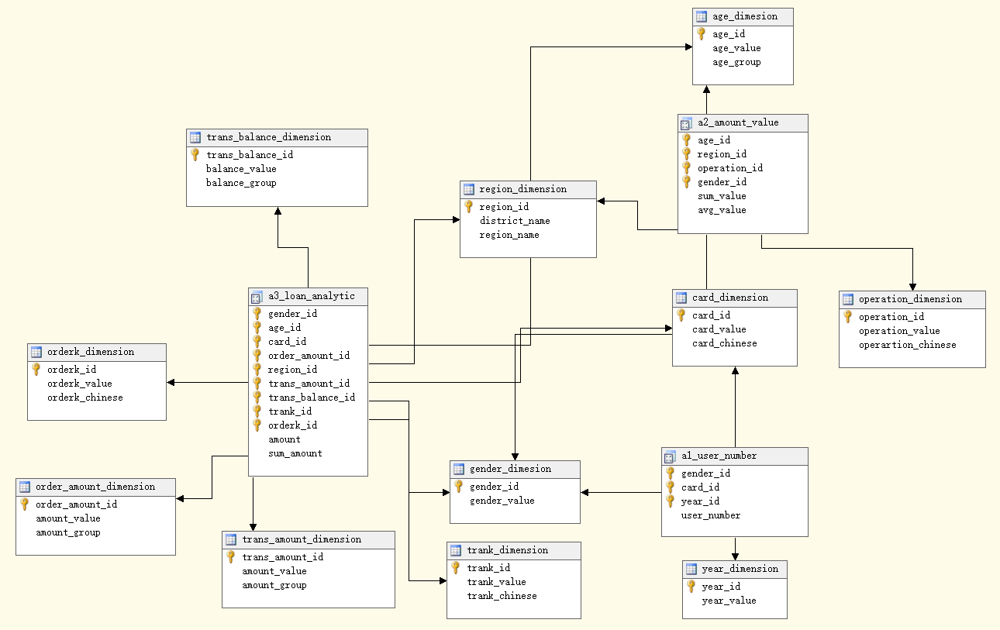
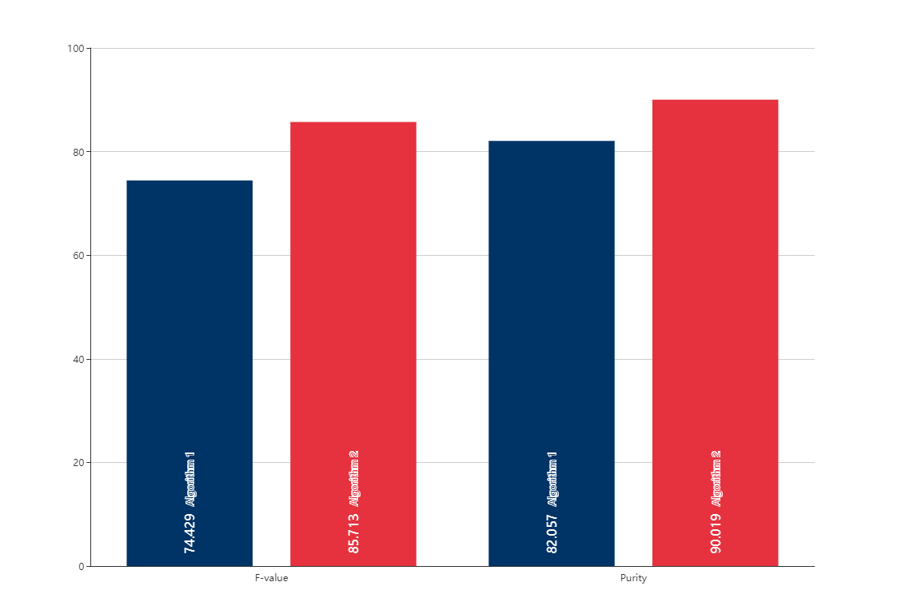

# Data-Repository
THU数据仓库与数据挖掘课程作业 

 * 第一次作业：银行贷款数据分析
 * 第二次作业：银行贷款数据分类和青蛙叫声MFCC数据聚类

## 1. 银行贷款数据分析

文档见[作业1报告](https://github.com/cuiods/DataRepository/blob/master/Homework1/%E9%93%B6%E8%A1%8C%E6%95%B0%E6%8D%AE%E5%88%86%E6%9E%90%E4%BD%9C%E4%B8%9A%E6%8A%A5%E5%91%8A.pdf)

实验数据集中包含了某银行业务处理信息，现在希望通过建立一个数据仓库对
以往业务记录进行分析，了解各类业务的运营情况，以期对日常业务处理（诸如发
放贷款额度，用户信用卡等级等）提供决策支持。 

1. 分析不同性别， 不同开通账户的时间段（ account.Date） ，不同信用卡类型（ card.Type）的用户数量情况。（比如， 在 1993 年开通账户的女
性中， 持有金卡(card.type = gold）的用户数是多少。 )

2. 针对不同性别，不同年龄段，不同大区（ district.region） ，分析交易表（ trans 表） 中不同操作(trains.operation)的金额情况， 包含该操作的总金
额（ amount 求和）与平均值（总金额/人数）。

3. 假设你是一个银行的数据分析人员，银行希望能够放出更多的贷款。请以放出更多的贷款作为目标，选择合适的维度进行分析，告知管理人员应该
把优惠政策和宣传力度集中到哪类人群。

## 2. 银行贷款数据分析

文档见[作业2报告](https://github.com/cuiods/DataRepository/blob/master/Homework2/%E4%BD%9C%E4%B8%9A2.pdf)

### 1) 银行直销数据分类

根据银行客户的属性判断客户是否会订阅某项定期存款业务，不限定分类算法，要求至少实现两种算法，并且对于算法精度进行分析比较

### 2) 青蛙叫声聚类

本任务根据青蛙的叫声所提取的 MFCC 特征，给不同科属的青蛙聚类。

